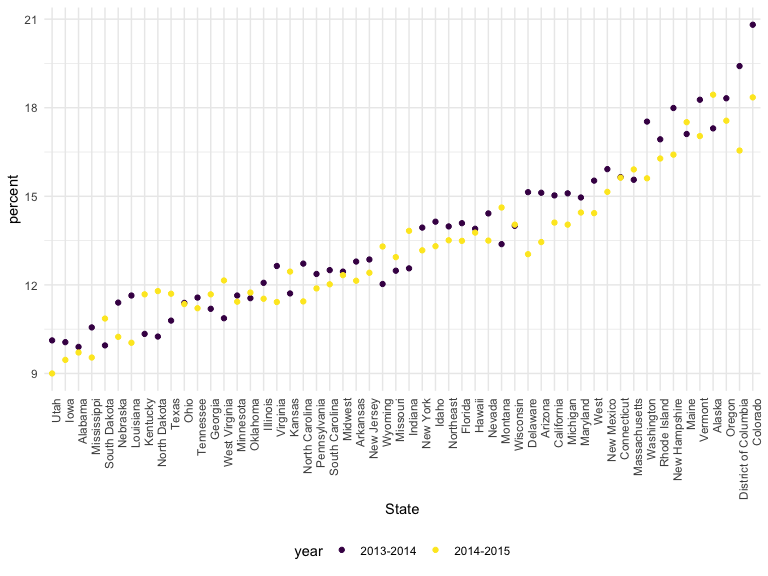
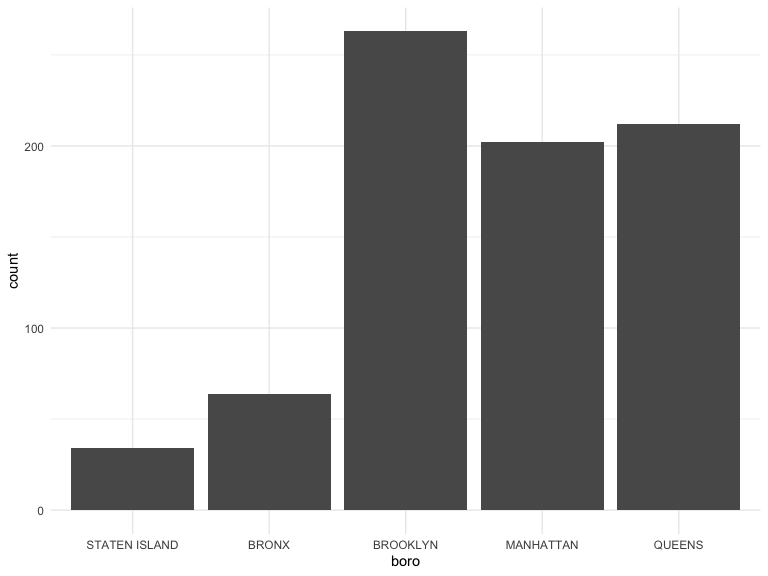

Strings and Factors
================

# Let’s do strings

``` r
string_vec = c("my", "name", "is", "lizy")

str_detect(string_vec, "a")
```

    ## [1] FALSE  TRUE FALSE FALSE

``` r
str_replace(string_vec, "lizy", "Lizy")
```

    ## [1] "my"   "name" "is"   "Lizy"

``` r
str_replace(string_vec, "i", "I")
```

    ## [1] "my"   "name" "Is"   "lIzy"

``` r
string_vec = c(
  "i think we all rule for participating",
  "i think i have been caught",
  "i think this will be quite fun actually",
  "it will be fun, i think"
  )

str_detect(string_vec, "^i think")
```

    ## [1]  TRUE  TRUE  TRUE FALSE

``` r
#carrot indicates to find the string in the beginning of the line
#dollar sign indicatest of ind the string at the end of the line
str_detect(string_vec, "i think$")
```

    ## [1] FALSE FALSE FALSE  TRUE

``` r
string_vec = c(
  "Time for a Pumpkin Spice Latte!",
  "went to the #pumpkinpatch last weekend",
  "Pumpkin Pie is obviously the best pie",
  "SMASHING PUMPKINS -- LIVE IN CONCERT!!"
  )

str_detect(string_vec,"[Pp]umpkin")
```

    ## [1]  TRUE  TRUE  TRUE FALSE

``` r
#multiple options for "P or p" inside the bracket will detect both upper and lowercase
```

``` r
string_vec = c(
  '7th inning stretch',
  '1st half soon to begin. Texas won the toss.',
  'she is 5 feet 4 inches tall',
  '3AM - cant sleep :('
  )

str_detect(string_vec, "^[0-9][a-zA-Z]")
```

    ## [1]  TRUE  TRUE FALSE  TRUE

``` r
#any numbers [0-9]
#any lowercase letter[a-z]
#any uppercase letter[A-Z]
```

``` r
string_vec = c(
  'Its 7:11 in the evening',
  'want to go to 7-11?',
  'my flight is AA711',
  'NetBios: scanning ip 203.167.114.66'
  )

str_detect(string_vec, "7.11")
```

    ## [1]  TRUE  TRUE FALSE  TRUE

``` r
#the "." matches with any character
```

How things start to get real strange…

``` r
string_vec = c(
  'The CI is [2, 5]',
  ':-]',
  ':-[',
  'I found the answer on pages [6-7]'
  )

#looking for open bracket
str_detect(string_vec, "\\[")
```

    ## [1]  TRUE FALSE  TRUE  TRUE

``` r
#two slashes before indicates to what we're looking for 
```

## Factors …

``` r
sex_vec = factor(c("male", "male", "female", "female"))

as.numeric(sex_vec)
```

    ## [1] 2 2 1 1

do some releveling…

``` r
sex_vec = fct_relevel(sex_vec, "male")
# changed underlying structure: male first, female second
as.numeric(sex_vec)
```

    ## [1] 1 1 2 2

## Revisig a lot of examples!

``` r
nsduh_url = "http://samhda.s3-us-gov-west-1.amazonaws.com/s3fs-public/field-uploads/2k15StateFiles/NSDUHsaeShortTermCHG2015.htm"

drug_use_html = read_html(nsduh_url)

# pieces I actually need 
marj_use_df = table_marj = table_marj = 
  read_html(nsduh_url) %>%  
  html_table() %>% 
  first() %>% 
  slice(-1) %>% 
  select(-contains("P Value")) %>% 
  pivot_longer(
    cols = -State,
    names_to = "age_year",
    values_to = "percent", 
  ) %>% 
  separate(age_year, into = c("age", "year"), sep = "\\(") %>% 
  mutate(
    year = str_replace(year, "\\)", ""),
    percent = str_remove(percent, "[a-c]$"),
    percent = as.numeric(percent)
  )

# slice -> select and remove the particular row
```

``` r
marj_use_df %>% 
  filter(age == "12-17", 
         !(State %in% c("Total U.S.", "South"))) %>%  
  mutate(
    State = fct_reorder(State, percent)
  ) %>% 
  ggplot(aes(x = State, y = percent, color = year)) + 
  geom_point() + 
    theme(axis.text.x = element_text(angle = 90, hjust = 1))
```



``` r
# the !(State) filter takes out the Total US or South (regional data instead of state-wide data)
```

## NYC Restaurant Inspections

``` r
data("rest_inspec")

rest_inspec %>% 
  count(boro, grade) %>% 
  pivot_wider(
    names_from = grade,
    values_from = n
  )
```

    ## # A tibble: 6 × 8
    ##   boro              A     B     C `Not Yet Graded`     P     Z  `NA`
    ##   <chr>         <int> <int> <int>            <int> <int> <int> <int>
    ## 1 BRONX         13688  2801   701              200   163   351 16833
    ## 2 BROOKLYN      37449  6651  1684              702   416   977 51930
    ## 3 MANHATTAN     61608 10532  2689              765   508  1237 80615
    ## 4 Missing           4    NA    NA               NA    NA    NA    13
    ## 5 QUEENS        35952  6492  1593              604   331   913 45816
    ## 6 STATEN ISLAND  5215   933   207               85    47   149  6730

``` r
rest_inspec =
  rest_inspec %>% 
  filter(
    str_detect(grade, "[A-C]"),
    !(boro == "Missing")
  )
```

``` r
rest_inspec %>% 
  mutate(dba = str_to_sentence(dba)) %>% 
  filter(str_detect (dba, "Pizza")) 
```

    ## # A tibble: 775 × 18
    ##    action          boro  building  camis critical_flag cuisine_description dba  
    ##    <chr>           <chr> <chr>     <int> <chr>         <chr>               <chr>
    ##  1 Violations wer… MANH… 151      5.00e7 Not Critical  Pizza               Pizz…
    ##  2 Violations wer… MANH… 151      5.00e7 Critical      Pizza               Pizz…
    ##  3 Violations wer… MANH… 151      5.00e7 Critical      Pizza               Pizz…
    ##  4 Violations wer… MANH… 15       5.01e7 Critical      Pizza               & Pi…
    ##  5 Violations wer… MANH… 151      5.00e7 Critical      Pizza               Pizz…
    ##  6 Violations wer… MANH… 151      5.00e7 Not Critical  Pizza               Pizz…
    ##  7 Violations wer… MANH… 15       5.01e7 Critical      Pizza               & Pi…
    ##  8 Violations wer… MANH… 151      5.00e7 Critical      Pizza               Pizz…
    ##  9 Violations wer… MANH… 84       5.00e7 Not Critical  Pizza               Pizza
    ## 10 Violations wer… MANH… 525      5.01e7 Not Critical  Pizza               Pizz…
    ## # ℹ 765 more rows
    ## # ℹ 11 more variables: inspection_date <dttm>, inspection_type <chr>,
    ## #   phone <chr>, record_date <dttm>, score <int>, street <chr>,
    ## #   violation_code <chr>, violation_description <chr>, zipcode <int>,
    ## #   grade <chr>, grade_date <dttm>

``` r
rest_inspec %>% 
  mutate(dba = str_to_sentence(dba)) %>% 
  filter(str_detect (dba, "Pizza")) %>% 
  mutate(boro = fct_infreq(boro)) %>% 
  ggplot(aes(x = boro)) +
  geom_bar()
```


``` r
rest_inspec %>% 
  mutate(dba = str_to_sentence(dba)) %>% 
  filter(str_detect (dba, "Pizza")) %>% 
  mutate(boro = fct_relevel(boro, "STATEN ISLAND")) %>% 
  ggplot(aes(x = boro)) +
  geom_bar()
```



``` r
rest_inspec %>% 
  mutate(dba = str_to_sentence(dba)) %>% 
  filter(str_detect (dba, "Pizza")) %>% 
  mutate(
    boro = fct_infreq(boro),
    boro = str_replace(boro, "MANHATTAN", "THE CITY")) %>% 
  ggplot(aes(x = boro)) +
  geom_bar()
```


``` r
#put it in order, updated manhattan to the city, and forced it back into alphabetical order making "THE CITY" to be the last in order 
```

``` r
rest_inspec %>% 
  mutate(dba = str_to_sentence(dba)) %>% 
  filter(str_detect (dba, "Pizza")) %>% 
  mutate(
    boro = fct_infreq(boro),
    boro = fct_recode(boro, "THE CITY" = "MANHATTAN")) %>% 
  ggplot(aes(x = boro)) +
  geom_bar()
```


``` r
##using fct_recode will just replace the name without changing the order of the graph
```

One last thing on factors …

``` r
rest_inspec %>% 
  mutate(dba = str_to_sentence(dba)) %>% 
  filter(str_detect(dba, "Pizza")) %>% 
  mutate(boro = fct_infreq(boro)) %>% 
  lm(zipcode ~ boro, data = .)
```

    ## 
    ## Call:
    ## lm(formula = zipcode ~ boro, data = .)
    ## 
    ## Coefficients:
    ##       (Intercept)         boroQUEENS      boroMANHATTAN          boroBRONX  
    ##           11222.4              147.9            -1196.9             -761.2  
    ## boroSTATEN ISLAND  
    ##            -912.1
